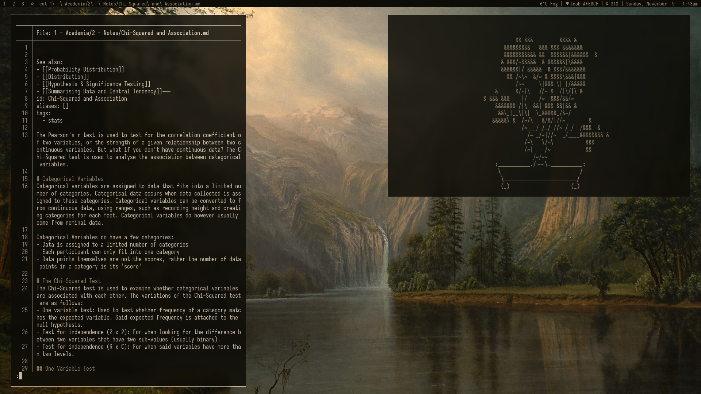
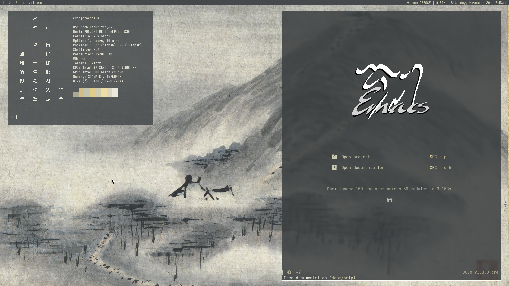

## dwm - dynamic window manager - croc's build

 

## Patches Applied

Some occasional modification here and there;

- [bartoggle keybinds](https://dwm.suckless.org/patches/bartoggle/)
- [bulkill](https://dwm.suckless.org/patches/bulkill/)
- [colorbar](https://dwm.suckless.org/patches/colorbar/)
- [fixmultimon](https://dwm.suckless.org/patches/fixmultimon/)
- [focusfullscreen](https://dwm.suckless.org/patches/focusfullscreen/)
- [focusmaster-return](https://dwm.suckless.org/patches/focusmaster/)
- [focusmonmouse](https://dwm.suckless.org/patches/focusmonmouse/)
- [hide vacant tags](https://dwm.suckless.org/patches/hide_vacant_tags/)
- [preventfocusshift](https://dwm.suckless.org/patches/preventfocusshift/)
- [restartsig](https://dwm.suckless.org/patches/restartsig/)
- [spawntag](https://dwm.suckless.org/patches/spawntag/)
- [stacker](https://dwm.suckless.org/patches/stacker/)
- [statuscmd](https://dwm.suckless.org/patches/statuscmd/)
- [sticky](https://dwm.suckless.org/patches/sticky/)
- [swallow](https://dwm.suckless.org/patches/swallow/)
- [vanitygaps](https://dwm.suckless.org/patches/vanitygaps/)
- [xrdb](https://dwm.suckless.org/patches/xrdb/)

## Basic Keybinds

All keybinds use `Mod` (Windows key) unless otherwise specified.

| Keybind                   | Action                              |
| ------------------------- | ----------------------------------- |
| `Mod + Enter`             | Open terminal                       |
| `Mod + P`                 | Launch dmenu                        |
| `Mod + Q`                 | Kill focused window                 |
| `Mod + Shift + Q`         | Kill all windows except focused     |
| `Mod + Shift + Backspace` | Exit dwm                            |
| `Mod + Ctrl + Shift + Q`  | Refresh dwm (recompile and restart) |

### Navigation & Focus

| Keybind             | Action                              |
| ------------------- | ----------------------------------- |
| `Mod + J/K`         | Focus next/previous window in stack |
| `Mod + Shift + J/K` | Move focused window in stack        |
| `Mod + Tab`         | Switch to previous tag              |
| `Mod + 1-9`         | Switch to tag N                     |
| `Mod + 0`           | View all tags                       |
| `Mod + Ctrl + 1-9`  | Toggle view of tag N                |
| `Mod + Shift + 1-9` | Move focused window to tag N        |

### Layout & Window Management

| Keybind               | Action                             |
| --------------------- | ---------------------------------- |
| `Mod + T`             | Tiled layout                       |
| `Mod + F`             | Toggle fullscreen                  |
| `Mod + Shift + M`     | Monocle layout                     |
| `Mod + S`             | Spiral layout                      |
| `Mod + Shift + T`     | Dwindle layout                     |
| `Mod + Ctrl + Space`  | Cycle layout                       |
| `Mod + Shift + Space` | Toggle floating                    |
| `Mod + Space`         | Zoom (promote to master)           |
| `Mod + Ctrl + Space`  | Focus master                       |
| `Mod + S`     | Toggle sticky window               |
| `Mod + H/L`           | Decrease/increase master area size |
| `Mod + Shift + I`     | Increase number of master windows  |
| `Mod + Ctrl + I`      | Decrease number of master windows  |

### Gaps Control

| Keybind           | Action                       |
| ----------------- | ---------------------------- |
| `Mod + +/-`       | Increase/decrease all gaps   |
| `Mod + Alt + I`   | Increase/decrease inner gaps |
| `Mod + Alt + O`   | Increase/decrease outer gaps |
| `Mod + Shift + =` | Toggle gaps                  |
| `Mod + Shift + -` | Reset gaps to default        |

### Multi-Monitor

| Keybind           | Action                          |
| ----------------- | ------------------------------- |
| `Mod + [`         | Focus next monitor              |
| `Mod + ]`         | Focus previous monitor          |
| `Mod + Shift + [` | Move window to next monitor     |
| `Mod + Shift + ]` | Move window to previous monitor |

### Applications

| Keybind           | Action                       |
|-------------------|------------------------------|
| `Mod + M`         | Open music player (ncspot)   |
| `Mod + B`         | Open browser                 |
| `Mod + E`         | Open Emacs                   |
| `Mod + N`         | Open neovim (in kitty)       |
| `Mod + Shift + F` | Open file manager (nautilus) |
| `Mod + Shift + H` | Open system monitor (htop)   |
| `Mod + V`         | Open clipboard history       |
| `Mod + Shift + N` | Open notes menu              |
| `Mod + Shift + A` | Open video menu              |
| `Mod + Ctrl + A`  | Switch audio output          |
| `Mod + Shift + W` | Wallpaper menu               |

### Screenshots & Misc

| Keybind           | Action         |
|-------------------|----------------|
| `Mod + Shift + S` | Screenshot     |
| `Mod + Shift + R` | Screen Record  |

### Statusbar

| Keybind           | Action                |
| ----------------- | --------------------- |
| `Mod + Shift + B` | Toggle bar visibility |
| `Mod + Ctrl + X`  | Refresh colors (xrdb) |
